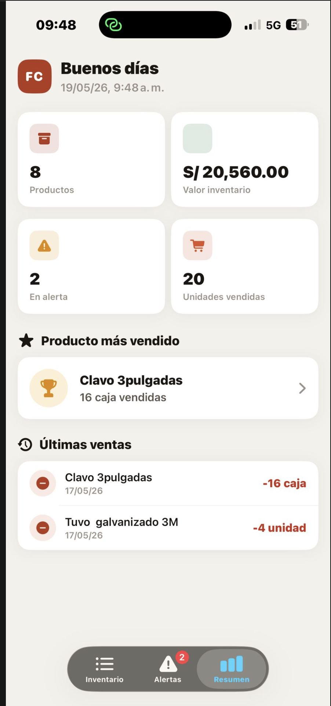
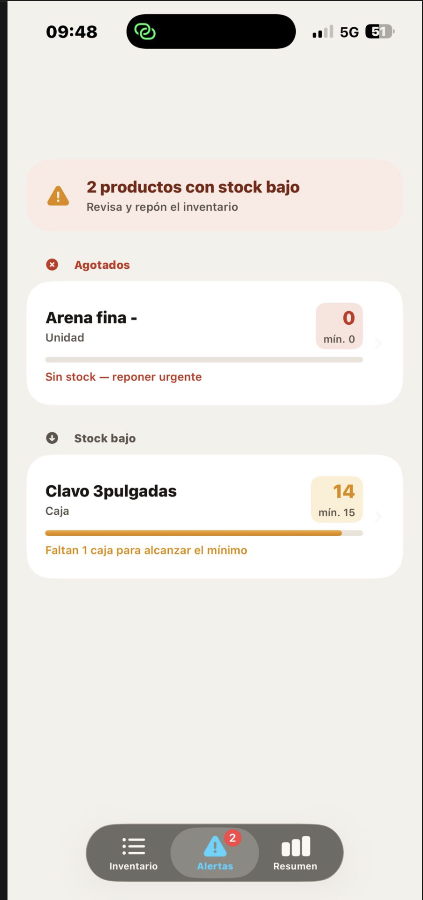
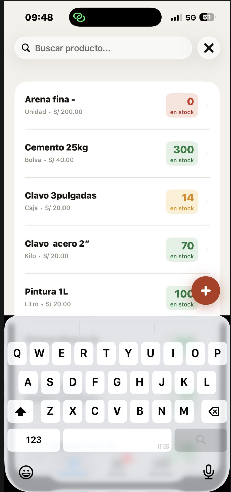
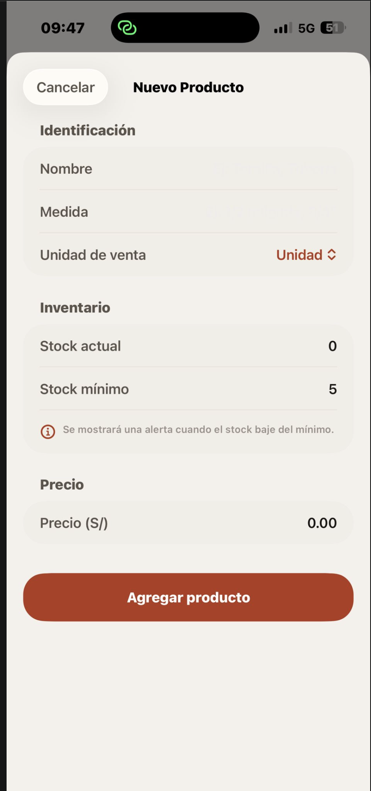
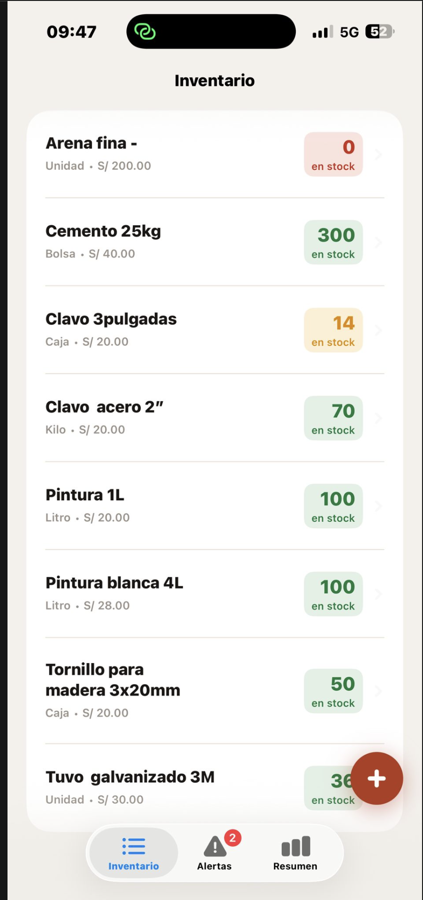

# FerreControl 🔧

An iOS inventory management app for hardware stores, built with SwiftUI, CoreData and MVVM architecture.

---

## 📱 Screenshots

| Home | Detalle |
|------|---------|
|  |  |

| Formulario | Búsqueda |
|------------|----------|
|  |  |

| Categorías |
|------------|
|  |

---

## ✨ Features

- 📦 Product inventory management
- ➕ Add, edit and delete products
- 🔍 Search products by name
- 🗂️ Filter by categories
- 💾 Local storage with CoreData
- 🏗️ MVVM architecture

---

## 🛠️ Tech Stack

| Technology | Usage |
|---|---|
| SwiftUI | UI Framework |
| CoreData | Local persistence |
| MVVM | Architecture pattern |
| Xcode 16 | IDE |
| Swift 5 | Language |

---

## 📋 Requirements

- iOS 17.0+
- Xcode 16+
- Swift 5+

---

## 🚀 Installation

1. Clone the repository
```bash
   git clone https://github.com/MerlinLpz/FerreControl.git
```
2. Open `FerreControl.xcodeproj` in Xcode
3. Build and run on simulator or physical device

---

## 👨‍💻 Author

**Merlín López**  
iOS Developer · Milano, Italia  
[GitHub](https://github.com/MerlinLpz)
